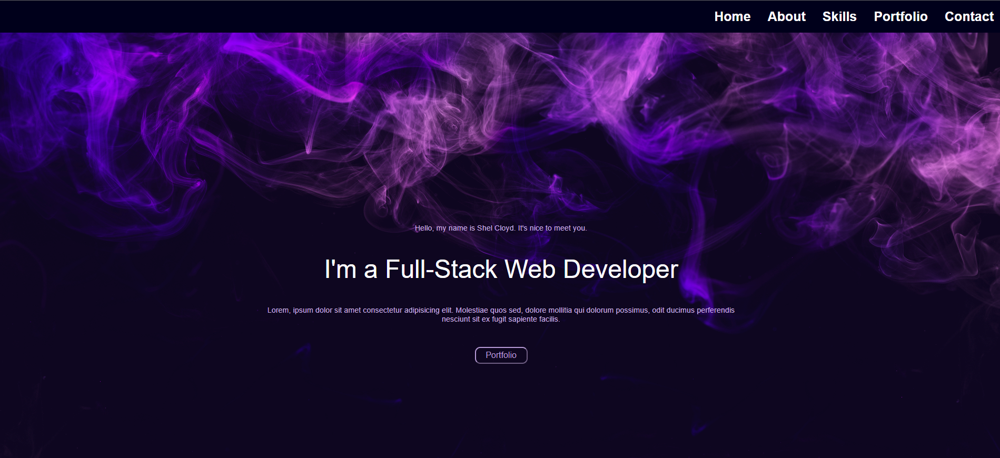
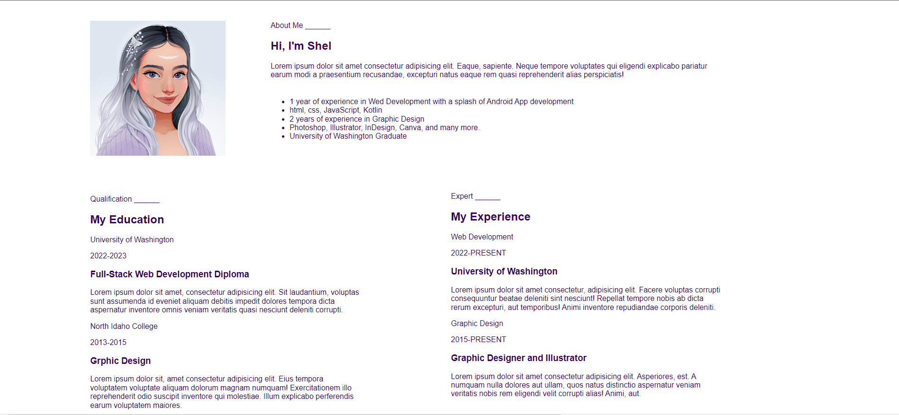
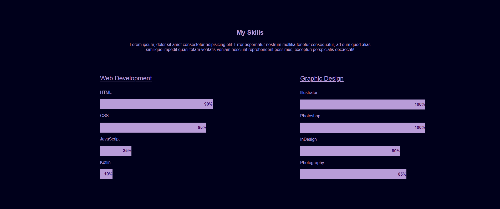

# Portfolio

This is a collection of my work I've created over the years. It is an ongoing work in progress as I learn new CSS techniques to make it even more elaborate and extra. But for now, I am pretty satisfied with the way it turned out.

If you open the dev tools, you can shrink the screen size down to 768px to simulate a tablet size screen, as well as 480px for phone size. The links in the portfolio also open the image or website in a new tab for taking a closer look.

